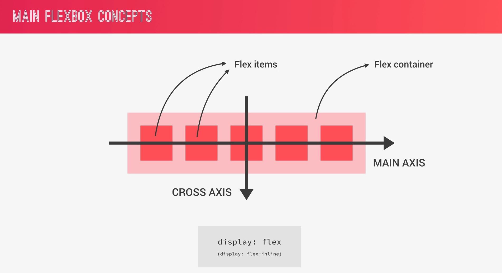
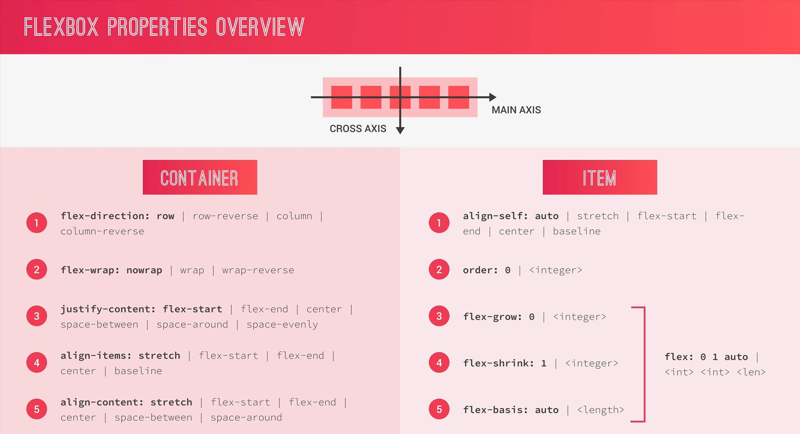

# **Flexbox**

Flexbox replaces float layouts and makes it easy to align elements to one another, in different directions and orders.

Check below for quick understanding.

* **Flexbox Concepts**

* **Flexbox Overview**
