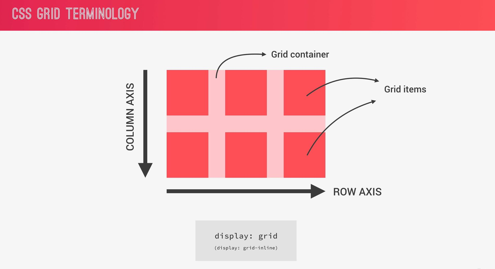
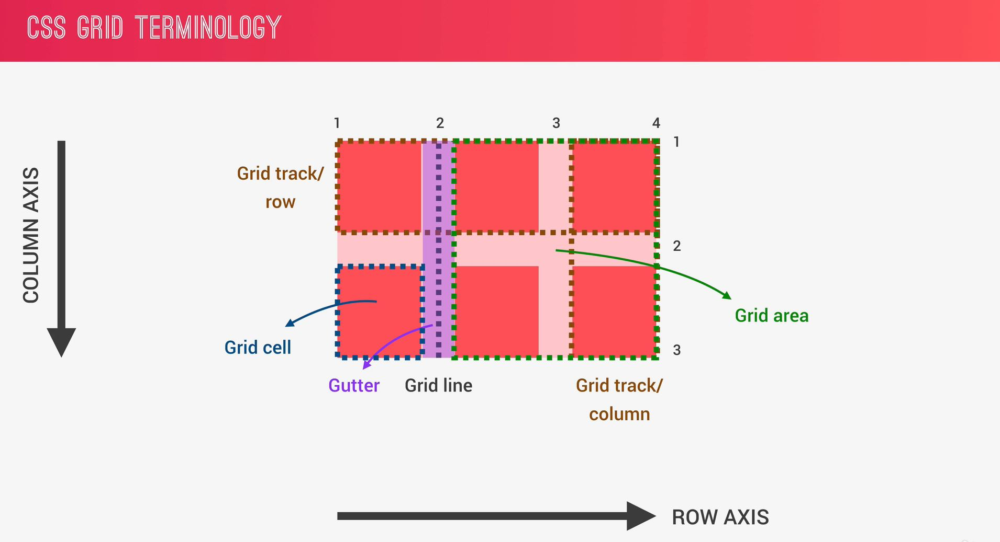
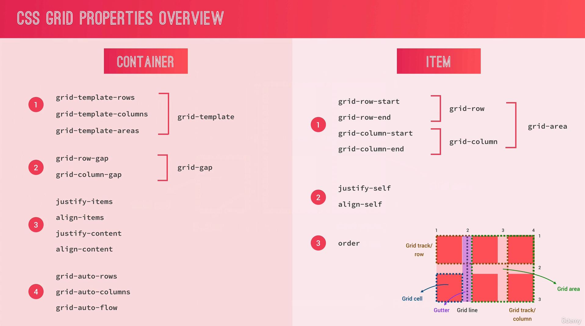

# **Grid-Layouts**

Grid Layout makes it easy to create two-dimensional layouts. 

**Concepts:**
* Grid template areas with px and fr units
* Positioning grid items and spanning

* **Grid Concepts**

* **Grid Overview**
